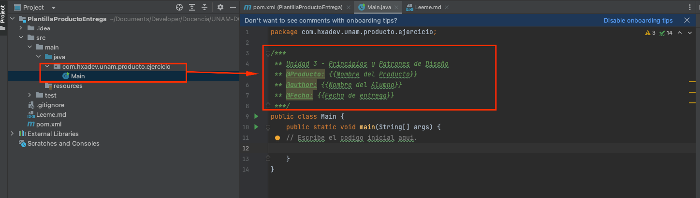

# Plantilla para ejercicio

Esta plantilla se realizo para facilitarte la creacion de un proyecto desde cero, sin embargo
puedes realizar tu programa como tu quieras, siempre y cuando sea funcional y sea ejecutable mediante JRE.
Es necesario que agregues elementos como "paquetes, clases, interfaces y cualquier componente que consideres
necesario para completar el desafio requerido."

## Informacion sobre la ejecucion del programa
Este proyecto fue realizado mediante un arquetipo maven, por lo que puede ser importado
a tu IDE de preferencia, ejemplo:
- Eclipse
- Intellij
- Netbeans
- Vscode
- etc.

## Entrega del programa
Para poder entregar tus programas necesitaras llenar la siguiente informacion en la clase Main

Unidad 3 - Principios y Patrones de Diseño\
@Producto: {{Nombre del Producto}}\
@author: {{Nombre del Alumno}}\
@Fecha: {{Fecha de entrega}}

Asi como tambien sera necesario que cambies el nombre del proyecto y la carpeta, el nombre sera a tu elección y unicamente tendra
que ser relacionado con el ejercicio que se te requiere.
